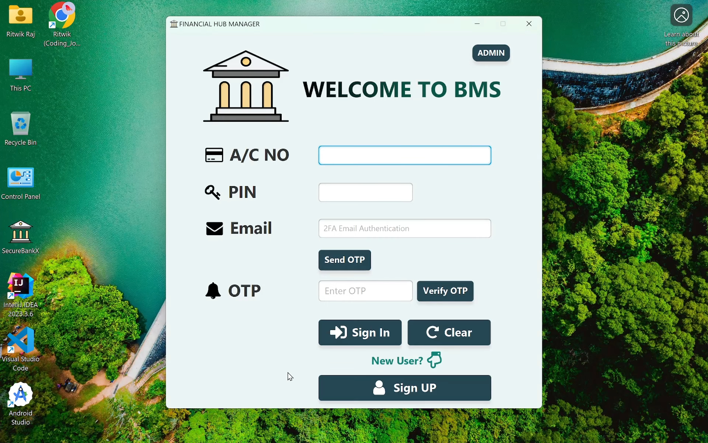

# Secure-BMS (Bank Management System) Project 🏦💻

## Checkout the Demo Video
[Watch on YouTube](https://www.youtube.com/watch?v=xssLBiUdnMg)

Secure-BMS is an advanced Java-based Bank Management System designed to provide robust security through multi-factor authentication. This project leverages cutting-edge technologies and incorporates features such as email-based OTP (One-Time Password) verification for enhanced security.

## Features 🚀

### Multi-Factor Authentication:

- Users undergo a two-step authentication process with Card Number, PIN, and Email inputs.
- Implements a secure email OTP verification system, adding an extra layer of protection.

### Graphical User Interface (GUI):

- Utilizes Java Swing for an intuitive and aesthetically pleasing user interface.
- Employs rounded buttons and input fields to enhance the overall user experience.

### OTP Generation and Verification:

- Utilizes a secure random OTP generation mechanism.
- Sends the OTP to the user's registered email for seamless verification.
- Implements a time-bound validation for OTP to prevent replay attacks.

### Responsive Design:

- GUI elements dynamically adjust for a seamless user experience on various screen sizes.
- Ensures accessibility and usability across different devices.

### Secure Email Communication:

- Integrates JavaMail API to enable secure email communication for OTP delivery.
- Encrypts sensitive data during transmission, ensuring data privacy.

## Dependencies 🛠️

- **Java Swing:** Empowers the creation of an engaging graphical user interface.
- **JavaMail API:** Facilitates secure email communication for OTP delivery.
- **JDBC (Java Database Connectivity):** Enables interaction with the underlying database for user authentication.

